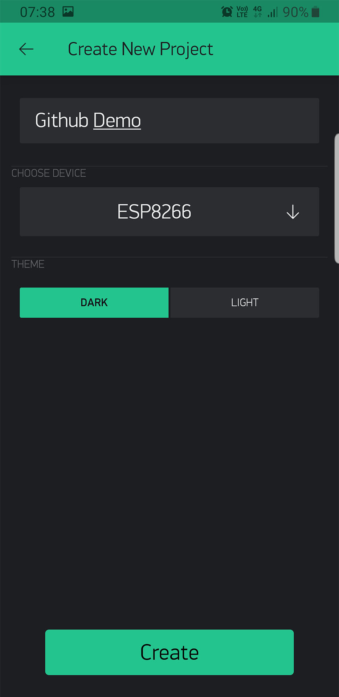
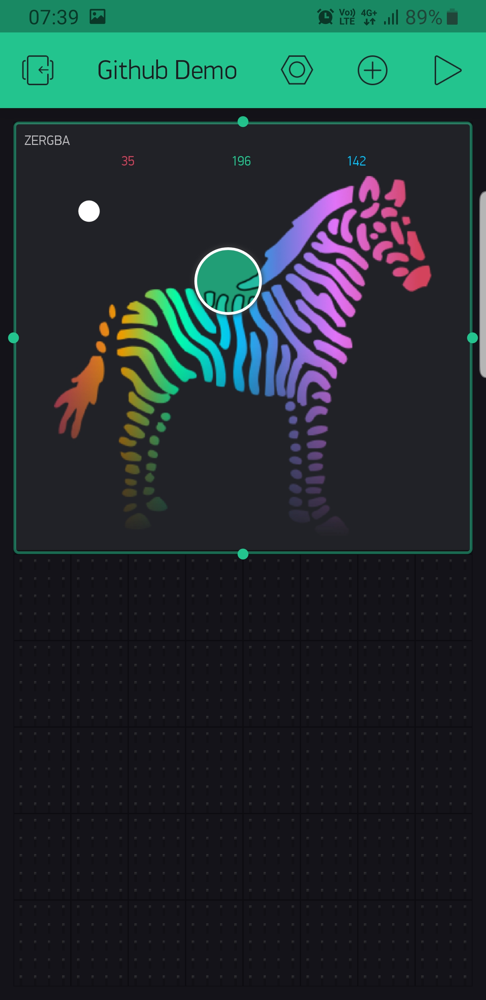
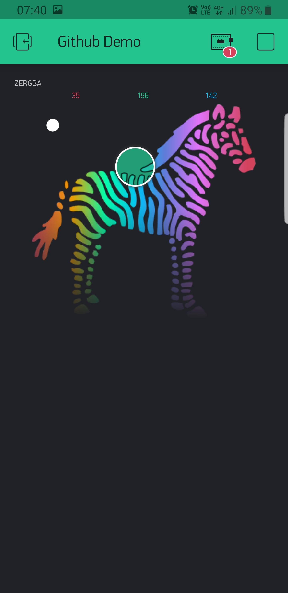
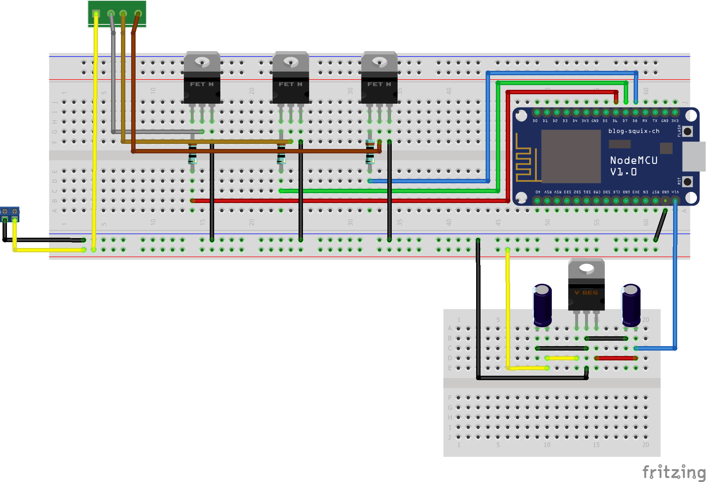
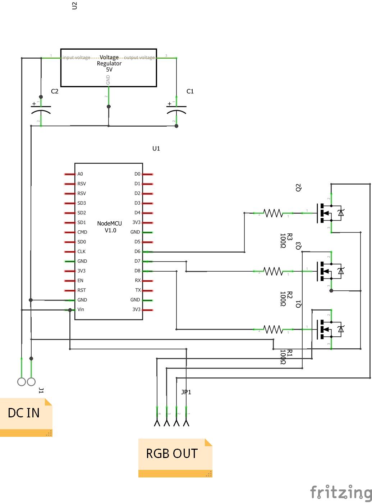
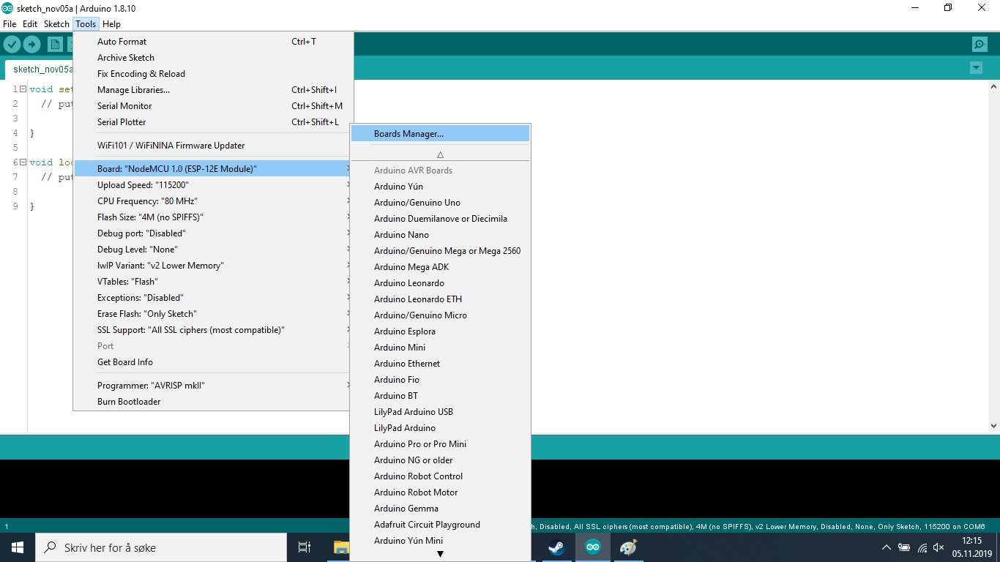
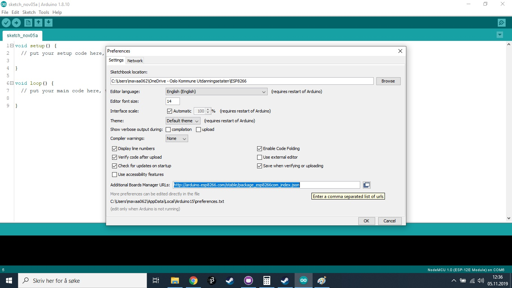
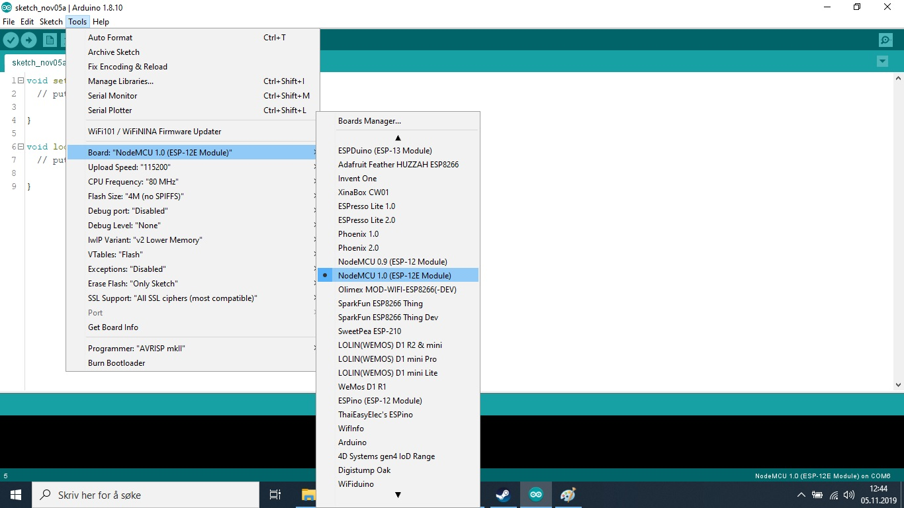

# Web Controlled RGB Ledstrip Using ESP8266 and BLYNK app
BLYNK is an phone app that makes it easy for user to make IoT projects using ESP8266/32, Arduino, Raspberry PI and many other boards. 

# Steps for starting using BLYNK.

1. First download the BLYNK app from [Appstore](https://apps.apple.com/us/app/blynk-iot-for-arduino-esp32/id808760481) or [Playstore](https://play.google.com/store/apps/details?id=cc.blynk&hl=no). 
2. Create a BLYNK acount or log in using Facebook. 
3. Create a project by giving it a name (here Github Demo) and choose a board type (in my case the ESP8266).
   

*NOTE! The app will send you an autorisation key to your E-mail which the board must have to connect to that project, each board must have it own autorisation key. you can add more board in the cogwheel at the top of the screen.*

4. Press the plus icon at the top to open the Widget Box, select the zeRGBa to place it in the workspace.
    

*NOTE! each widget cost energy, you start with 2000 energy, and you can buy more if you need more.*

5. Hold you finger on the zeRGBa widget to enter move and resize mode. Place the widget where you want it and make it bigger for ease of use. 
   

6. Enter widget setting by tapping on the widget, and change the pin inputs to the pins used for RGB PWM output on the ESP8266. (I use GPO15, GPO13, GPO12 for RED, GREEN, BLUE) i suggest disabling "send on release".

*NOTE! target is used for selecting which board you want to control if you have multiple board connected to the same project*
7. Close the widget settings. And start the project by pressing the play button at the top

# Making the circuit board
Componenst used:
* 1 x [NodeMCU ESP8266 Development board](https://www.ebay.com/sch/i.html?_from=R40&_trksid=m570.l1313&_nkw=nodemcu+esp8266+esp-12+v3&_sacat=65507&LH_TitleDesc=0&_osacat=65507&_odkw=nodemcu+esp8266+esp-12)
* 3 x [IRF510](https://www.ebay.com/sch/i.html?_from=R40&_trksid=m570.l1313&_nkw=irf510&_sacat=0&LH_TitleDesc=0&_osacat=0&_odkw=irf510n)
* [RGB led strip](https://www.ebay.com/sch/i.html?_from=R40&_trksid=m570.l1313&_nkw=5050+SMD+600+LED+RGB+&_sacat=0&LH_TitleDesc=0&_osacat=0&_odkw=2+x+5M+10M+5050+SMD+600+LED+RGB+Flexible+Strip+Light+Car+Auto+DC+12V+ED)
* 1 x [LM7805 Voltage regulator](https://www.ebay.com/sch/i.html?_from=R40&_trksid=m570.l1313&_nkw=lm7805cv&_sacat=0&LH_TitleDesc=0&_osacat=0&_odkw=lm7805)
* 2 x [1μF Capasitor](https://www.ebay.com/sch/i.html?_nkw=1uf+capacitor+electrolytic&_sop=15)
* 3 x [1kΩ Resistor](https://www.ebay.com/sch/i.html?_from=R40&_trksid=m570.l1313&_nkw=1k+resistor&_sacat=0)
* [Protoboard](https://www.ebay.com/sch/i.html?_from=R40&_trksid=m570.l1313&_nkw=protoboard+dot&_sacat=0&LH_TitleDesc=0&_osacat=0&_odkw=protoboard)

I used Frizing to make the circuit.

# How to install ESP library in Arduino IDE
Start by Dowloading the latest version of [arduino IDE](https://www.arduino.cc/en/Main/Software).

After insalling Arduino, open file, preferences, and copy http://arduino.esp8266.com/stable/package_esp8266com_index.json into additional board manager url.

Then open Tools, Board, Boards manager. 
Search for ESP in the blank field and install the latest version of ESP8266.

When done installing close the Boards manager and select the board to NodeMCU 1.0.

Open the example file for the NodeMCU board. (File/examples/Blynk/Boards_WiFi/NodeMCU)

In the example code put in the autorisation key you got sent in previous steps, and insert your SSID and password.

